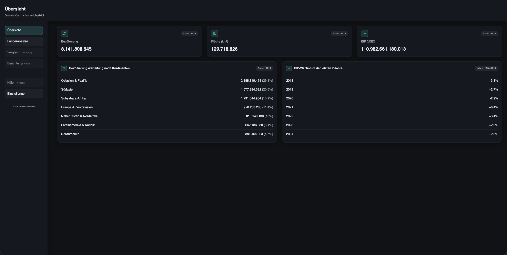
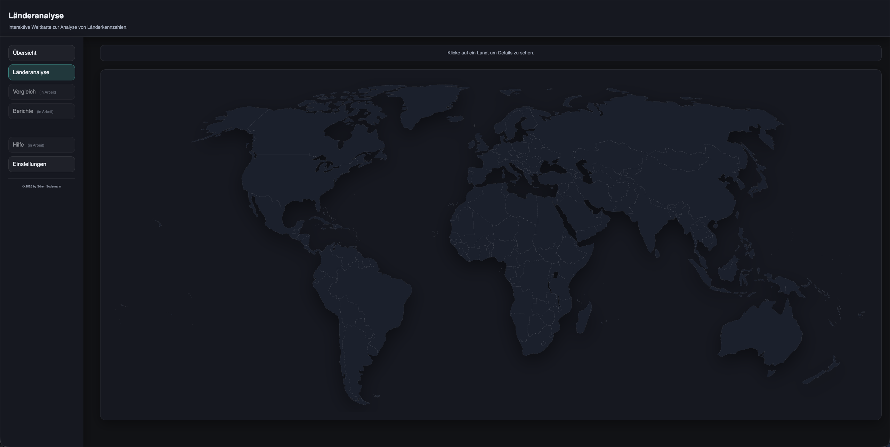
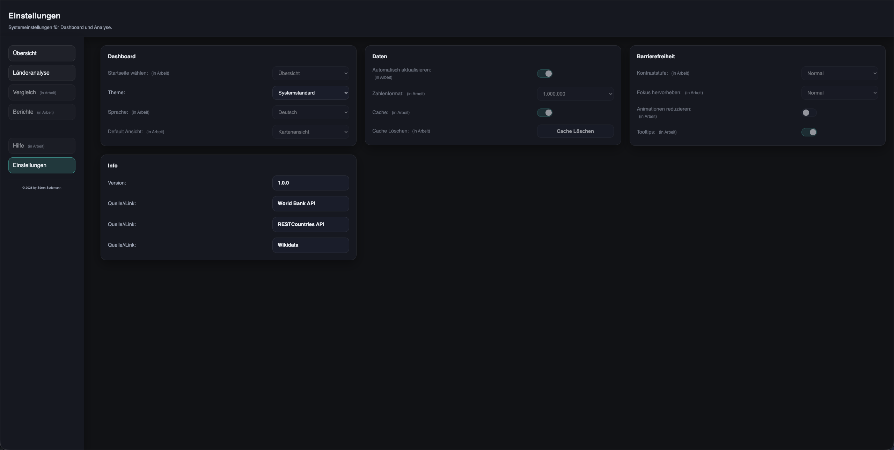
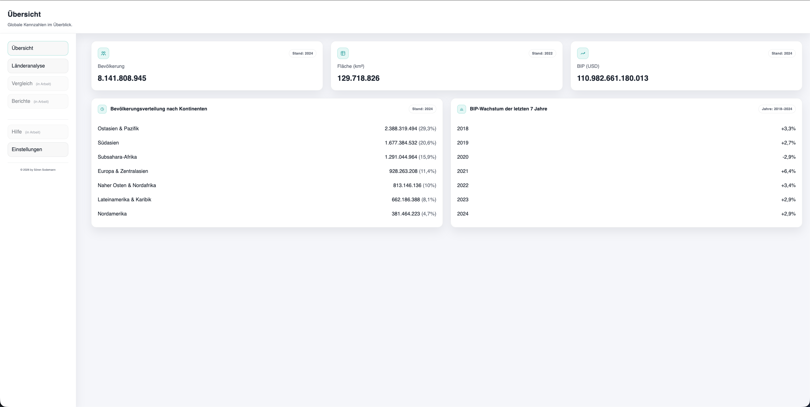
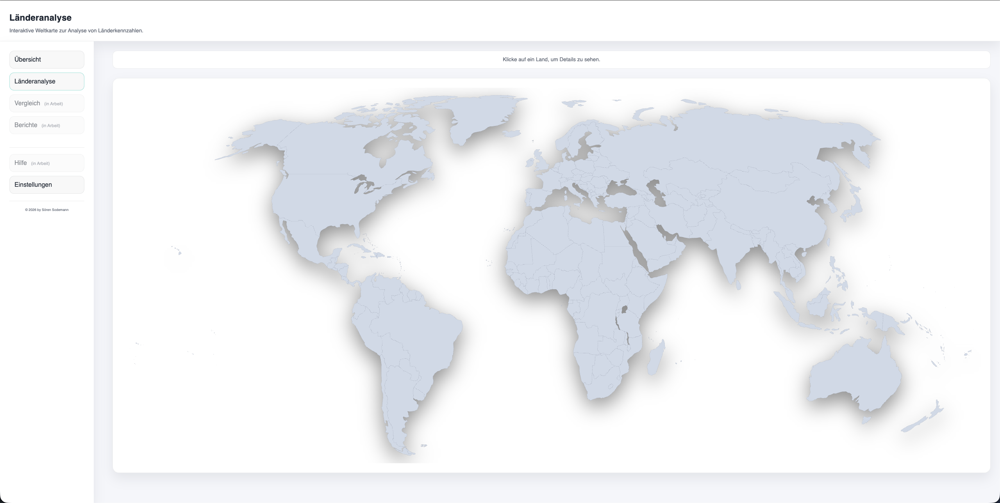
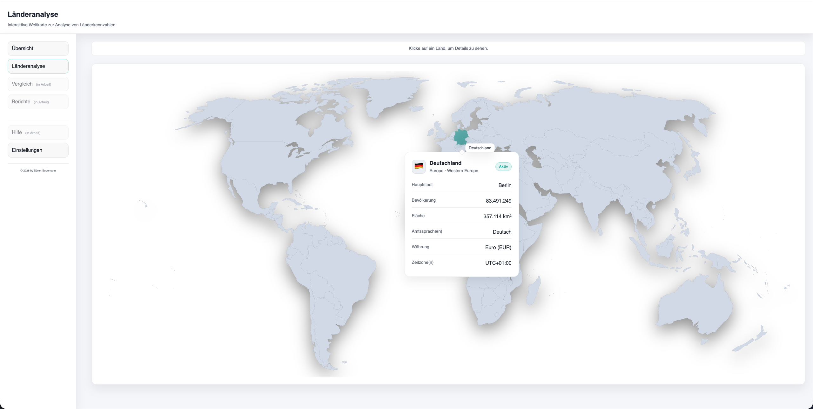
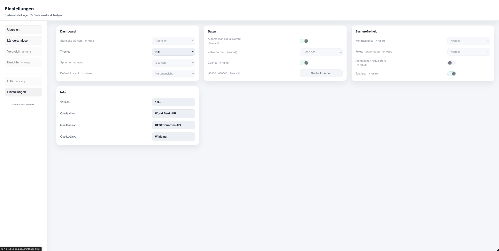

# Abschlussprojekt für Modul 2/4 – Sodemann

**Modul:** 2/4 – Webentwicklung (Syntax Institut, Berlin)

Dashboard zur Visualisierung globaler KPIs (Bevölkerung, Fläche, BIP) sowie eine Länderanalyse mit interaktiver SVG-Weltkarte.  
Datenquellen: **World Bank API**, **REST Countries API** und **Wikidata (SPARQL)**.

## Links

- Live Demo https://soeren-sodemann.github.io/Laenderanalayse-Dashboard/
- Repository https://github.com/Soeren-Sodemann/Laenderanalayse-Dashboard

**Mindestanforderungen:**

- API-Anbindung
- Fehlerhandling für API-Requests
- Responsives Design (Desktop + Mobile)

---

# Projekt

Ziel: Globale Kennzahlen schnell erfassen und Länder im Detail analysieren.

## Tech-Stack

- HTML, CSS, Vanilla JavaScript
- World Bank API, REST Countries API, Wikidata (Hauptstädte via SPARQL)
- SVG World Map (Blank Map)

## Features

- Übersicht: KPIs für Weltbevölkerung, Fläche, BIP (inkl. Datenstand)
- Bevölkerung nach Kontinenten (Werte + Prozentanteil)
- BIP-Wachstum der letzten 7 Jahre (Welt, Listenansicht)
- Länderanalyse: interaktive SVG-Weltkarte (Hover + Klick)
  - Tooltip für Ländernamen (deutsch) beim Hover
  - Detail-Popover beim Klick (öffnet sich über dem Land)
- Deutsche Bezeichnungen (Länder, Währungen, Hauptstädte) via Mapping (REST Countries/Wikidata)
- Einstellungen-Seite: Theme-Switching (hell/dunkel/system) gespeichert via localStorage
- Modulares JS (API, Service, UI, Config getrennt)
- Loading-/Empty-/Error-States
- Responsives Layout (Desktop + Mobile)
- Barrierefreiheit (Kontrast, ARIA, Tastatur-Navigation)
- Clean Code + Kommentare

## Bekannte Einschränkungen

- Einige Bereiche sind als **(in Arbeit)** markiert und deaktiviert.
- Loading-/Empty-/Error-States sind noch nicht auf allen Seiten komplett vereinheitlicht.

## Screenshots

### Darkmode

- Übersichtseite:
  

- Länderanalyse-Seite:
  

- Länderanalyse-Seite (aktiv):
  

- Einstellungen-Seite:
  

### Lightmode

- Übersichtseite:
  

- Länderanalyse-Seite:
  

- Länderanalyse-Seite (aktiv):
  

- Einstellungen-Seite:
  

## Datenquellen

- [World Bank API](https://data.worldbank.org/)  
  KPIs, Kontinent-Gruppen, BIP-Wachstum (Konfiguration: `js/overview/config.js`)
- [REST Countries API](https://restcountries.com/)  
  Länderinformationen + Namensdaten (Konfiguration: `js/country-analysis/config.js`, Export: `data/country-names-de.json`)
- [Wikidata Query Service](https://query.wikidata.org/)  
  Hauptstädte (Export: `data/capitals-de.json`)

## Lokales Starten

- `index.html` mit VS Code **Live Server** starten (wegen `type="module"`).
- Von dort aus zu `Länderanalyse` und `Einstellungen` navigieren.

## Struktur

- `index.html` – Dashboard (Startseite)
- `pages/country-analysis.html` – Länderanalyse mit SVG-Map + Detail-Popover
- `pages/settings.html` – Einstellungen

- `css/`
  - `basic.css` – Basis/Reset/Defaults
  - `layout.css` – Layout/Grids/Container
  - `overview-page.css` – Styles nur für Overview
  - `country-analysis-page.css` – Styles nur für Länderanalyse
  - `settings-page.css` – Styles nur für Settings

- `js/overview/`
  - `app.js` – Einstiegspunkt (init + Orchestrierung)
  - `config.js` – Konstanten (API, Indicator-Codes, Locale, Continent-Codes)
  - `api.js` – Fetch/WorldBank API-Requests + Fehlerhandling
  - `service.js` – Logik (KPIs/Listen/Serien zusammenbauen)
  - `ui.js` – UI-Rendering (Loading/Empty/Error, Listen in Panels)

- `js/shared/`
  - `dom.js` – DOM-Helper (select, setText, setBadge)
  - `formatters.js` – Number/Percent-Formatter (Intl)
  - `preferences.js` – Theme/Preferences-Handling (localStorage, data-theme)

- `js/country-analysis/`
  - `app.js` – Einstiegspunkt (Map-Handling, Auswahl, State)
  - `config.js` – Konstanten (Locale, API)
  - `api.js` – Fetch/REST Countries Requests + Fehlerhandling
  - `service.js` – Logik (Matching/Normalisierung)
  - `ui.js` – UI Rendering + Formatierung

- `js/settings/`
  - `app.js` – Theme-Auswahl + Speicherung

- `assets/`
  - `svg/` – SVG Weltkarte, favicon.svg
  - `images/` – favicons png
  - `screenshots/` – Screenshots

- `data/`
  - `capitals-de.json` – Mapping ISO-2 → deutsche Hauptstädte (Wikidata Export)
  - `country-names-de.json` – Mapping für deutsche Ländernamen (REST Countries Export)

## To-Do

### Übersichtsseite

- [x] Welt-KPIs (Bevölkerung, Fläche, BIP) anzeigen
- [x] Bevölkerung nach Kontinenten (Werte + Prozentanteil)
- [x] BIP-Wachstum der letzten 7 Jahre (Welt, Listenansicht)
- [x] Fehlerzustände sauber anzeigen (Offline, 404, Rate-Limit)
- [x] Loading-Status anzeigen
- [x] Responsives Design optimieren
- [x] Barrierefreiheit (Kontrast, ARIA, Tastatur-Navigation) verbessern
- [x] Clean Code (API, UI, Logik trennen) und Kommentare ergänzen
- [ ] Caching (SessionStorage/LocalStorage): API-Antworten kurz speichern
- [ ] Performance optimieren (Ladezeiten, Rendern)
- [ ] Dokumentation weiter verbessern

### Länderanalyse-Seite

- [x] Interaktive SVG-Weltkarte (Hover + Klick auf Länder)
- [x] Datenanbindung für Länderanalyse (REST Countries)
- [x] Tooltip für Ländernamen (deutsch) beim Hover
- [x] Detail-Popover beim Klick (Positionierung über/unter dem Pfad)
- [x] Info-Daten: Flagge, Name, Hauptstadt, Region, Population, Fläche, Sprache, Währung, Zeitzone
- [x] Fehlerzustände sauber anzeigen (Offline, 404, Rate-Limit, „Land nicht gefunden“)
- [x] Fallback für fehlende Länderinformationen implementieren
- [x] Loading-Status anzeigen
- [x] Karteninteraktion verbessern (Hover/Klick-Zustände, Cursor)
- [x] Responsives Design optimieren
- [x] Barrierefreiheit (Kontrast, ARIA, Tastatur-Navigation) verbessern
- [x] Clean Code + Kommentare
- [ ] Karte zoombar machen
- [ ] Reset / Clear Selection (Auswahl zurücksetzen + Zoom reset)
- [ ] Zoom auf ausgewähltes Land

### Einstellungen

- [x] Grundstruktur der Seite erstellen (HTML + CSS)
- [x] Theme-Switching (hell/dunkel/system)
- [x] Theme-Präferenz speichern (localStorage)
- [ ] Reduced Motion Toggle
- [ ] Weitere Einstellungen speichern (localStorage)
- [ ] Sprache wechseln

### Hinweis zu Statusmarkierungen

- [x] Markierte Punkte sind abgeschlossen
- [ ] Markierte Punkte sind offen / noch nicht begonnen
